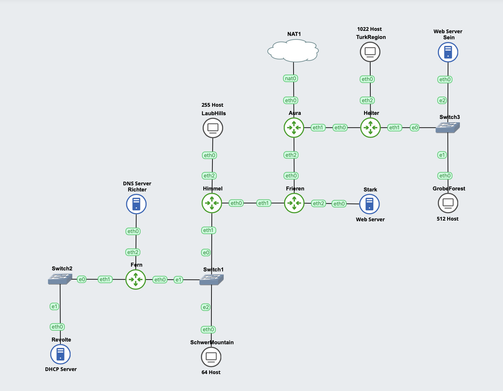

# Jarkom-Modul-5-I05-2023

## Modul 5 Jarkom 2023 I05 Formal Report

Group Members:
| No |  Name    |  NRP  |
| ---       |   ---     |---  |
|     1     |     Khairiya Maisa Putri    | 5025211192 |
|     2     |     Talitha Hayyinas Sahala    |  5025211263 |

## Group Preifx IP
```10.61```

## Topologi GNS3


## Topologi VLSM


## Route

The following is the route that we have created from the results of the VLSM topology as follows


# Preparation

## VLSM TREE

The tree we created was obtained from the results of the VLSM Topology grouping as follows


## IP sharing

The following is the IP distribution that we have obtained from the Tree results


## Subnetting

The following is the subneeting that we have adjusted to the IP that has been obtained.

### Aura
```
auto eth0
iface eth0 inet dhcp

#A8
auto eth1
iface eth1 inet static
address 10.61.1.29
netmask 255.255.255.252

#A6
auto eth2
iface eth2 inet static
address 10.61.1.11
netmask 255.255.255.252

```

### Heiter

```
auto lo
iface lo inet loopback

#A8
auto eth0
iface eth0 inet static
address 10.61.1.30
netmask 255.255.255.252
gateway 10.61.1.29

#A9
auto eth1
iface eth1 inet static
address 10.61.8.1
netmask 255.255.248.0

#A10
auto eth2
iface eth2 inet static
address 10.61.4.1
netmask 255.255.252.0

```

### Frieren
```
auto lo
iface lo inet loopback

#A6
auto eth0
iface eth0 inet static
address 10.61.1.12
netmask 255.255.255.252
gateway 10.61.1.11

#A7
auto eth1
iface eth1 inet static
address 10.61.1.25
netmask 255.255.255.252

#A4
auto eth2
iface eth2 inet static
address 10.61.1.17
netmask 255.255.255.252

```

### Himmel

```
auto lo
iface lo inet loopback

#A4
auto eth0
iface eth0 inet static
address 10.61.1.18
netmask 255.255.255.252
gateway 10.61.1.17

#A5
auto eth1
iface eth1 inet static
address 10.61.2.1
netmask 255.255.254.0

#A3
auto eth2
iface eth2 inet static
address 10.61.1.129
netmask 255.255.255.128

```
### Fern

```
auto lo
iface lo inet loopback

#A3
auto eth0
iface eth0 inet static
address 10.61.1.130
netmask 255.255.255.128
gateway 10.61.1.129

#A2
auto eth1
iface eth1 inet static
address 10.61.1.13
netmask 255.255.255.252

#A1
auto eth2
iface eth2 inet static
address 10.61.1.9
netmask 255.255.255.252

```

### Revolte

```
auto eth0
iface eth0 inet static
address 10.61.1.10
netmask 255.255.255.252
gateway 10.61.1.9

```

### Richter
```
auto eth0
iface eth0 inet static
address 10.61.1.14
netmask 255.255.255.252
gateway 10.61.1.13
```

### Stark

```
auto eth0
iface eth0 inet static
address 10.61.1.26
netmask 255.255.255.252
gateway 10.61.1.25
```

### Sein

```
auto eth0
iface eth0 inet static
address 10.61.4.2
netmask 255.255.252.0
gateway 10.61.4.1
```

### Client

```
auto eth0
iface eth0 inet dhcp
```

## Routing

After subnetting each `node`. Now we will move on to the routing setup as follows

### Aura

```
#Heiter
up route add -net 10.61.4.0 netmask 255.255.252.0 gw 10.61.1.130
up route add -net 10.61.8.0 netmask 255.255.248.0 gw 10.61.1.130

#Frieren
up route add -net 10.61.1.24 netmask 255.255.255.252 gw 10.61.1.17
up route add -net 10.61.1.16 netmask 255.255.255.252 gw 10.61.1.17
up route add -net 10.61.2.0 netmask 255.255.254.0 gw 10.61.1.17
up route add -net 10.61.1.128 netmask 255.255.255.128 gw 10.61.1.17
up route add -net 10.61.1.12 netmask 255.255.255.252 gw 10.61.1.17
up route add -net 10.61.1.8 netmask 255.255.255.252 gw 10.61.1.17
```

### Heiter 

```
up route add -net 0.0.0.0 netmask 0.0.0.0 gw 10.61.1.29
```

### Frieren

```
up route add -net 10.61.2.0 netmask 255.255.254.0 gw 10.61.1.18
up route add -net 10.61.1.128 netmask 255.255.255.128 gw 10.61.1.18
up route add -net 10.61.1.12 netmask 255.255.255.252 gw 10.61.1.18
up route add -net 10.61.1.8 netmask 255.255.255.252 gw 10.61.1.18
up route add -net 0.0.0.0 netmask 0.0.0.0 gw 10.61.1.11
```

### Himmel 

```
up route add -net 10.61.1.12 netmask 255.255.255.252 gw 10.61.1.130
up route add -net 10.61.1.12 netmask 255.255.255.252 gw 10.61.1.130
up route add -net 0.0.0.0 netmask 0.0.0.0 gw 10.61.1.17
```

### Fern

```
up route add -net 0.0.0.0 netmask 0.0.0.0 gw 10.61.1.129
```

## Configuration

Before configuring each predetermined `router`, here we have to run the following command on the `Aura` router

```
iptables -t nat -A POSTROUTING -o eth0 -j MASQUERADE -s 10.61.0.0/16
```

After that, don't forget to give each `node` the nameserver `192.168.122.1` so it can connect to the internet.

### DNS Server

Here the one that acts as the `DNS Server` is the `Richter` router and the configuration will be carried out as follows with the help of `bash` later

```
# Richter
echo 'nameserver 10.61.122.1' >/etc/resolv.conf

apt update
apt install netcat -y
apt install bind9 -y

echo `
options {
  directory "/var/cache/bind";
  forwarders {
    10.61.122.1;
  };
  allow-query {any;};
  auth-nxdomain no; # conform to RFC1035
  listen-on-v6 {any;};
}' > /etc/bind/named.conf.options 

service bind9 restart 

```


### DHCP Server

After successfully setting up the `DNS Server`. Now we move on to do some necessary configurations on the `DHCP Server` as follows

```
#Revolte
echo 'nameserver 192.168.122.1' > /etc/resolv.conf

apt update
apt install netcat -y
apt install isc-dhcp-server -y

echo 'INTERFACESv4="eth0"' > /etc/default/isc-dhcp-server

echo '
# option definitions common to all supported networks...
option domain-name "example.org";
option domain-name-servers ns1.example.org, ns2.example.org;

default-lease-time 600;
max-lease-time 7200;

# have support for DDNS.)
ddns-update-style none;

# A10
subnet 10.61.4.0 netmask 255.255.252.0 {
  range 10.61.4.2 10.61.7.254;
  option routers 10.61.4.1;
  option broadcast-address 10.61.7.255; 
  option domain-name-servers 10.61.1.14;
  default-lease-time 720;
  max-lease-time 7200;
}

# A9
subnet 10.61.8.0 netmask 255.255.248.0 {
  range 10.61.8.2 10.61.7.254;
  option routers 10.61.8.1;
  option broadcast-address 10.61.15.255;
  option domain-name-servers 10.61.1.14;
  default-lease-time 720;
  max-lease-time 7200;
}

# A5
subnet 10.61.2.0 netmask 255.255.254.0 {
  range 10.61.2.2 10.61.7.254;
  option routers 10.61.2.1;
  option broadcast-address 10.61.3.255;
  option domain-name-servers 10.61.1.14;
  default-lease-time 720;
  max-lease-time 7200;
}

# A3
subnet 10.61.1.128 netmask 255.255.255.128 {
  range 10.61.1.131 10.61.7.254;
  option routers 10.61.1.129;
  option broadcast-address 10.61.1.255;
  option domain-name-servers 10.61.1.14;
  default-lease-time 720;
  max-lease-time 7200;
}

# A8
subnet 10.61.1.28 netmask 255.255.255.252 {}

# A6
subnet 10.61.1.10 netmask 255.255.255.252 {}

# A7
subnet 10.61.1.24 netmask 255.255.255.252 {}

# A4
subnet 10.61.1.16 netmask 255.255.255.252 {}

# A2
subnet 10.61.1.12 netmask 255.255.255.252 {}

# A10
subnet 10.61.1.8 netmask 255.255.255.252 {}
' > /etc/dhcp/dhcpd.conf

service isc-dhcp-server start

```

Here you can see that we also setup each `subnet` which will later be used by each `DHCP client`.

### DHCP Relay

For `DHCP Relay`, we need to consider it first, because the concept of DHCP Relay is that DHCP Relay acts as an intermediary `between` the `client` and the `DHCP server`. When a client sends a DHCP request, the relay captures the message and sends it to the DHCP server via unicast (not broadcast).

So here we need to configure the router adjacent to the client which will be given an `IP` by DHCP. So here we provide `DHCP Relay` on the `Heiter` and `Himmel` routers. Because Heiter is close to clients `TurkRegion` and `GrobeForest`, while Himmel is close to `LaubHills` and `SchwerMountain`. The configuration is as follows

```
# Heiter and Himmel
echo 'nameserver 192.168.122.1' > /etc/resolv.conf

apt update
apt install netcat -y
apt install isc-dhcp-relay -y

echo '
SERVERS="10.61.1.10"
INTERFACES="eth0 eth1 eth2 eth3"
OPTIONS=""
' > /etc/default/isc-dhcp-relay

# Jangan lupa uncomment 
# nano /etc/sysctl.conf
# net.ipv4.ip_forward=1

service isc-dhcp-relay restart
```
Then don't forget to uncomment  `net.ipv4.ip_forward=1 in /etc/sysctl.conf`

### WEB Server

On the  `web server` we will use apache2 and will be configured for the `Sein and Stark` routers as follows

```
# Sein and Stark
echo 'nameserver 192.168.122.1' > /etc/resolv.conf

apt update
apt install netcat -y
apt install apache2 -y
service apache2 start

echo '# If you just change the port or add more ports here, you will likely also
# have to change the VirtualHost statement in
# /etc/apache2/sites-enabled/000-default.conf

Listen 80
Listen 443

<IfModule ssl_module>
        Listen 443
</IfModule>

<IfModule mod_gnutls.c>
        Listen 443
</IfModule>

# vim: syntax=apache ts=4 sw=4 sts=4 sr noet' > /etc/apache2/ports.conf
```

Then in `/var/www/html/index.html` in each Sein or Start node add the following:

```
echo '# Sein | Stark
Sein | Stark nih' > /var/www/html/index.html
```

### Client

For each  `client`, we only need to install Lynx because it will be used for testing later

```
apt update
apt install netcat -y
apt install lynx -y
```

# Answer

After successfully configuring as above, now don't forget to  `restart (stop then start again)` on the `Aura` router because it will be used in Problem 1

## No 1

There are 2 options for working on this question. The first is that setup can be done directly from the start without `MASQUERADE`, the second can be done directly without `MASQUERADE`. If you choose the first option, then you must restart the Aura node to ensure that the previous `iptables` is no longer there. If you use the second method, there is no need to `restart` the `Aura` node.

Using the second method, configuration is carried out so that the topology can access the outgoing internet (NAT). Without MASQUERADE, configuration is done using simple scripting, namely by using `SNAT --to-source` which leads to the NID of the router associated with the NAT, namely `10.61.0.0/20`. In other words, this IP is the outermost / furthest IP that includes all the IPs that we obtained previously.

However, first you need to define which interface is connected via NAT. In this case it is Aura, the associated interface is eth0. The definition can be put into a variable. Here, a variable named `IPETH0` is used.

```
# No 1 (Aura)
IPETH0="$(ip -br a | grep eth0 | awk '{print $NF}' | cut -d'/' -f1)"
iptables -t nat -A POSTROUTING -o eth0 -j SNAT --to-source "$IPETH0" -s 10.61.0.0/20
```

## No 2

To filter `TCP` and `UDP` and allow only `port 8080` to access them. So it is necessary to `define` the definition of the `IP Address` and port `8080`. The following is the `sh` command on the `Revolte` node

```
iptables -A INPUT -p tcp --dport 8080 -j ACCEPT
iptables -A INPUT -p tcp -j DROP
iptables -A INPUT -p udp -j DROP
```

Explanation

- `-A INPUT`: Adds rules to the INPUT chain (the chain used for traffic going to the system).
- `-p tcp`: Specifies the protocol used, in this case TCP. --dport 8080: Specifies the destination port, in this case port 8080.
- `-j ACCEPT`: Specifies the action to take if the packet meets the rule criteria, in this case accept the packet.
- `-j DROP`: Specifies the action to be taken if the packet meets the rule criteria, in this case rejecting (DROP) the packet.
So, this rule allows TCP traffic going to port 8080 to be received.

## No 3

To limit the number of connections, iptables can add states that can be connected first. The types of states that can be connected are `ESTABLISHED` and `RELATED`.

Next, by utilizing the ICMP port, limit the connection with `--connlimit-above` using parameter 3. Don't forget, use mask 0 which means all access will be filtered from `--connlimit`. If there are 3 connections, the next connection will be dropped.

```
iptables -I INPUT -p icmp -m connlimit --connlimit-above 3 --connlimit-mask 0 -j DROP
iptables -I INPUT -m state --state ESTABLISHED,RELATED -j ACCEPT
```

Explanation

- `-I INPUT`: Inserts a rule to the beginning of the INPUT chain.
- `-p icmp`: Specifies the protocol used, in this case ICMP (Internet Control Message Protocol), which is often used for ping and network control messages.
- `-m connlimit`: Uses the connlimit module to limit the number of connections.
- `--connlimit-above 3`: Specifies the upper limit on the number of connections allowed. In this case, this rule will try to limit the number of ICMP connections above 3.
- `--connlimit-mask 0`: Sets a mask to identify connections. With a value of 0, this rule will limit the number of connections based on the source IP address.
- `--state ESTABLISHED,RELATED`: Specifies that this rule will be applied to packets related to established connections (ESTABLISHED) or related to existing connections (RELATED), for example, response packets related to connection requests.
- `-m state`: Uses the state module to manage connection state.
- `-j DROP`: Specifies the action to be taken if connection limits are exceeded, in this case dropping (DROP) the packet.

So, this rule will reject ICMP packets if the number of ICMP connections from a single IP address exceeds 3. This rule also allows packets related to established connections or related to existing connections to enter the system. This ensures that responses from existing connections or packets related to already established connections are received.

## No 4

`SSH connection / SSH port: 22` Here we do `iptables` for the server that functions as a `Web Server`, namely the `Sein` and `Stark` nodes. On this node we will allow port 22 and will provide access to the GrobeForest client. But GrobeForest has an IP that always changes, because `GrobeForest` gets the IP from the `DHCP Server`, and the IP is in the `range 10.61.4.2 10.61.7.254`

```
iptables -A INPUT -p tcp --dport 22 -s 10.61.x.x -j ACCEPT
iptables -A INPUT -p tcp --dport 22 -j DROP
```

Explanation

- `-A INPUT`: Adds rules to the INPUT chain (the chain used for traffic going to the system).
-`-p tcp`: Specifies the protocol used, in this case TCP.
- `-dport 22`: Specifies the destination port, in this case port 22 (generally used for SSH services).
- `-s 10.61.x.x`: Specifies permitted source addresses. In this case, only traffic originating from IP addresses starting with 10.61.x.x is allowed through.
- `-j ACCEPT`: Specifies the action to take if the packet meets the rule criteria, in this case accept the packet.
- `-j DROP`: Specifies the action to be taken if the packet meets the rule criteria, in this case rejecting (DROP) the packet.
So, this rule allows TCP traffic going to port 22 (SSH) from IP addresses starting with 10.61.x.x to be received. This rule denies all TCP traffic going to port 22 (SSH). This conflicts with previous rules that allowed SSH traffic from certain IP addresses. Therefore, this rule is a "general disallow" for SSH traffic that does not comply with the first rule.

## No 5

Because here the Webserver can only be accessed during working hours, you can use the help of `time` and more specifically you need the `--weekdays` command to read the day of entry (Monday, Tuesday, Wednesday, Thursday, Friday). We also need to use `timestart` and `timeout` to limit access.

```
iptables -A INPUT -m time --timestart 08:00 --timestop 16:00 --weekdays Mon,Tue,Wed,Thu,Fri -j ACCEPT
iptables -A INPUT -j REJECT
```

Explanation

- `-A INPUT`: Adds rules to the INPUT chain (the chain used for traffic going to the system).
- `-m time`: Use the time module to define time-based rules.
- `--timestart 08:00`: Specifies the start time, in this case 08:00.
- `--timestop 16:00`: Specifies the end time, in this case 16:00.
- `--weekdays Mon,Tue,Wed,Thu,Fri`: Specifies the days on which this rule applies, in this case Monday to Friday.
- `-j ACCEPT`: Specifies the action to take if the packet meets the rule criteria, in this case accepting the packet.
- `-j REJECT`: Specifies the action to be taken if the packet does not meet the rule criteria, in this case rejecting (REJECT) the packet.
So, this rule allows incoming traffic (INPUT) only during the time range between 08:00 to 16:00 on Monday to Friday. This rule also rejects all traffic that does not comply with the previous rule. This includes traffic outside the time range or on days that do not fall within Monday to Friday.

## No 6

> Lalu, karena ternyata terdapat beberapa waktu di mana network administrator dari WebServer tidak bisa stand by, sehingga perlu ditambahkan rule bahwa akses pada hari Senin - Kamis pada jam 12.00 - 13.00 dilarang (istirahat maksi cuy) dan akses di hari Jumat pada jam 11.00 - 13.00 juga dilarang (maklum, Jumatan rek).


To limit the connection time, ```iptables``` on the Web Server (Sein and Stark) needs to define the hours when it can be connected or dropped. Here, we will block the connection during the lunch break on **weekdays** from ```Senin - Kamis``` at ```12:00 - 13:00``` and from ```11:00 - 13:00``` on ```Fridays```. You can use the following command:

```
iptables -I INPUT 3 -m time --timestart 12:00 --timestop 13:00 --weekdays Mon,Tue,Wed,Thu -j REJECT
iptables -I INPUT 4 -m time --timestart 11:00 --timestop 13:00 --weekdays Fri -j REJECT
```

- ```-I INPUT 3 / 4```: Adds a rule to the INPUT chain (the chain used for traffic directed towards the system) and places it at index 3 or 4.
- ```-m time```: Uses the time module to establish rules based on time.
- ```--timestart 12:00```: Specifies the start time, in this case, 12:00 PM.
- ```--timestop 13:00```: Specifies the end time, in this case, 1:00 PM.
- ```--weekdays Mon,Tue,Wed,Thu```: Specifies the days on which this rule is valid, in this case, Monday through Thursday.
- ```--timestart 11:00```: Specifies the start time, in this case, 11:00 AM.
- ```--timestop 13:00```: Specifies the end time, in this case, 1:00 PM.
- ```--weekdays Fri```: Specifies the day on which this rule is valid, in this case, Friday.
- ```-j REJECT```: Specifies the action taken if a packet meets the rule criteria, in this case, rejecting (REJECT) the packet.

So, this rule rejects INPUT traffic on Monday through Thursday between 12:00 PM and 1:00 PM. It also rejects INPUT traffic on Friday between 11:00 AM and 1:00 PM.

## No 7
> Karena terdapat 2 WebServer, kalian diminta agar setiap client yang mengakses Sein dengan Port 80 akan didistribusikan secara bergantian pada Sein dan Stark secara berurutan dan request dari client yang mengakses Stark dengan port 443 akan didistribusikan secara bergantian pada Sein dan Stark secara berurutan.

To work on question 7, it is necessary to set up the web server first. First, it is required to configure the ports.conf as follows:

```sh
echo '
Listen 80
Listen 443

<IfModule ssl_module>
        Listen 443
</IfModule>

<IfModule mod_gnutls.c>
        Listen 443
</IfModule>
' > /etc/apache2/ports.conf
```
Then create a page or a simple **initialization** that indicates it is a message from that **node**.

```sh
echo '# Sein | Stark
Sein | Stark nih' > /var/www/html/index.html
```

After allowing the **HTTPS port**, it's time to configure by creating a simple web server as follows:

```sh
echo "
<VirtualHost *:80>
    ServerName 10.61.4.2
    DocumentRoot /var/www/html
    ErrorLog \${APACHE_LOG_DIR}/error.log
    CustomLog \${APACHE_LOG_DIR}/access.log combined
</VirtualHost>
<VirtualHost *:443>
    ServerName 10.61.4.2
    DocumentRoot /var/www/html
    ErrorLog \${APACHE_LOG_DIR}/error.log
    CustomLog \${APACHE_LOG_DIR}/access.log combined
</VirtualHost>
" > /etc/apache2/sites-available/sein.conf

a2ensite sein.conf
service apache2 restart
```

After that, perform ```iptables``` on the **router** that leads to the **web servers**, namely Sein and Stark, as follows:

```
iptables -A PREROUTING -t nat -p tcp --dport 80 -d 10.61.4.2 -m statistic --mode nth --every 2 --packet 0 -j DNAT --to-destination 10.61.4.2:80
iptables -A PREROUTING -t nat -p tcp --dport 80 -d 10.61.4.2 -j DNAT --to-destination 10.61.1.118:80
iptables -A PREROUTING -t nat -p tcp --dport 443 -d 10.61.1.118 -m statistic --mode nth --every 2 --packet 0 -j DNAT --to-destination 10.61.1.118:443
iptables -A PREROUTING -t nat -p tcp --dport 443 -d 10.61.1.118 -j DNAT --to-destination 10.61.4.2:443
```

## No 8
> Karena berbeda koalisi politik, maka subnet dengan masyarakat yang berada pada Revolte dilarang keras mengakses WebServer hingga masa pencoblosan pemilu kepala suku 2024 berakhir. Masa pemilu (hingga pemungutan dan penghitungan suara selesai) kepala suku bersamaan dengan masa pemilu Presiden dan Wakil Presiden Indonesia 2024.

To work on this number, the assistance of ```--datestart``` and ```--datestop``` is required to restrict access on specific days. Here, the **subnet** from **Revolte** is needed because the desired restriction is against the subnet. Our **subnet** here is located on A10, with the IP ```10.61.1.104/30```, and determining the protocol used as follows:

```
iptables -A INPUT -p tcp --dport 80 -s 10.61.1.104/30 -m time --datestart 2023-12-10 --datestop 2024-02-15 -j DROP
```
- ```-A INPUT```: Adds a rule to the INPUT chain (chain used for traffic directed towards the system).
- ```-p tcp```: Specifies the protocol used, in this case, TCP.
- ```--dport 80```: Specifies the destination port, in this case, port 80 (commonly used for HTTP services).
- ```-s 10.61.1.104/30```: Specifies the allowed source address. In this case, only traffic originating from the IP range 10.61.1.104 to 10.61.1.107 (10.61.1.104/30) is permitted to enter.
- ```-m time --datestart 2023-12-10 --datestop 2024-02-15```: Uses the time module to establish rules based on dates. This rule will be in effect from December 10, 2023, to February 15, 2024.
- ```-j DROP```: Specifies the action taken if a packet meets the rule criteria, in this case, dropping (DROP) the packet.

## No 9
> Sadar akan adanya potensial saling serang antar kubu politik, maka WebServer harus dapat secara otomatis memblokir  alamat IP yang melakukan scanning port dalam jumlah banyak (maksimal 20 scan port) di dalam selang waktu 10 menit. 
(clue: test dengan nmap)

Because in question 9, we need to use port scanning, a special chain called ```"portscan"``` is required. This chain can be used to manage rules related to port scanning detection.

```
iptables -N portscan

iptables -A INPUT -m recent --name portscan --update --seconds 600 --hitcount 20 -j DROP
iptables -A FORWARD -m recent --name portscan --update --seconds 600 --hitcount 20 -j DROP

iptables -A INPUT -m recent --name portscan --set -j ACCEPT
iptables -A FORWARD -m recent --name portscan --set -j ACCEPT
```

```iptables -N portscan```: This creates a special chain named "portscan." This chain can be used to manage rules related to port scanning detection.

```
iptables -A INPUT -m recent --name portscan --update --seconds 600 --hitcount 20 -j DROP
```

- ```-m recent --name portscan```: Uses the recent module to track connections or packets.
- ```--update```: Updates information about the current packet.
- ```--seconds 600```: Sets the time in seconds, in this case, 600 seconds (10 minutes).
- ```--hitcount 20```: Sets the number of hits (updates) required to trigger the next action.
- ```-j DROP```: Specifies the action taken if the rule criteria are met, in this case, dropping (DROP) the packet.

So, this rule will drop INPUT packets if more than 20 updates occur within a 10-minute period, which can be considered an indication of a port scanning attack.

```
iptables -A FORWARD -m recent --name portscan --update --seconds 600 --hitcount 20 -j DROP
```

Adding a rule to the FORWARD chain. Similar to the previous rule, this rule handles packets that pass through the system, i.e., forwarded packets. If the number of packet updates exceeds 20 within 10 minutes, the packet will be rejected.

```
iptables -A INPUT -m recent --name portscan --set -j ACCEPT
```
- ```-m recent --name portscan```: Uses the recent module to track connections or packets.
- ```--set```: Sets information related to the new packet.
- ```-j ACCEPT```: Specifies the action taken if the rule criteria are met, in this case, accepting the packet.

So, this rule allows new INPUT packets to pass through and sets information that indicates that this packet is not related to a port scanning attack.

```
iptables -A FORWARD -m recent --name portscan --set -j ACCEPT
```

Adding a rule to the FORWARD chain. Similar to the previous rule, this rule allows forwarded packets to pass through and sets information indicating that these packets are not related to a port scanning attack.

## No 10
> Karena kepala suku ingin tau paket apa saja yang di-drop, maka di setiap node server dan router ditambahkan logging paket yang di-drop dengan standard syslog level. 

